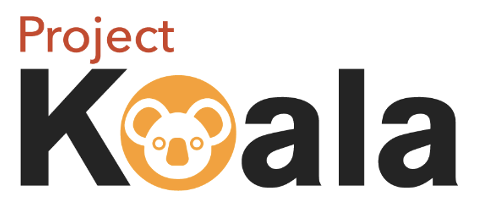
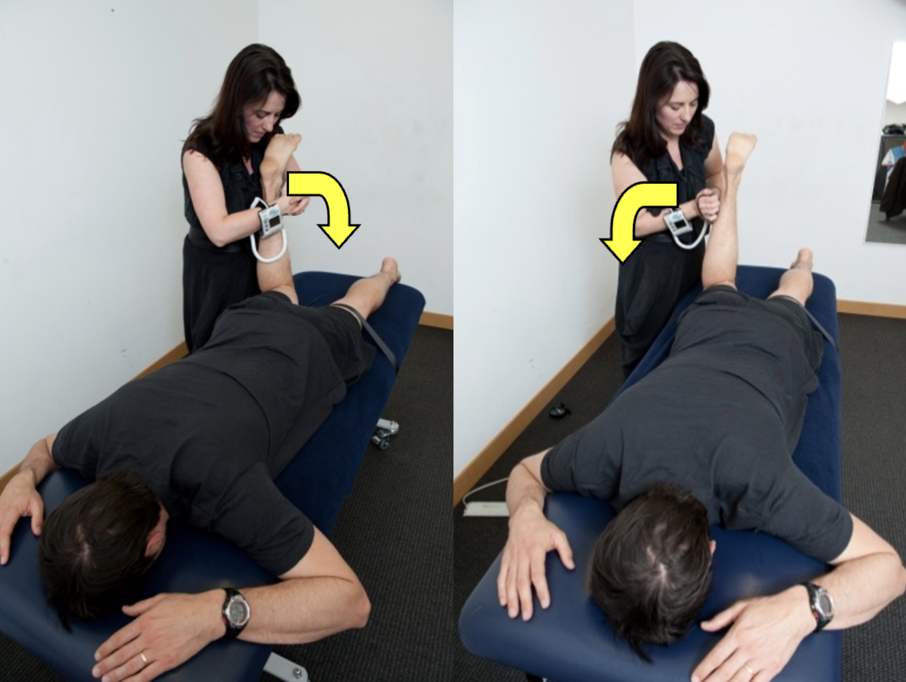
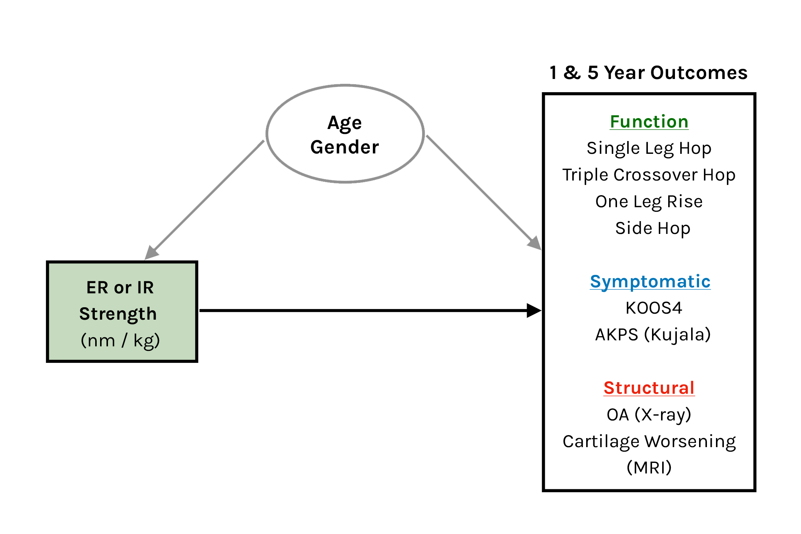
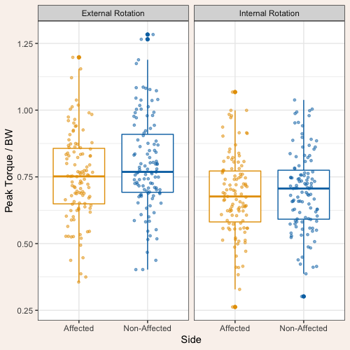
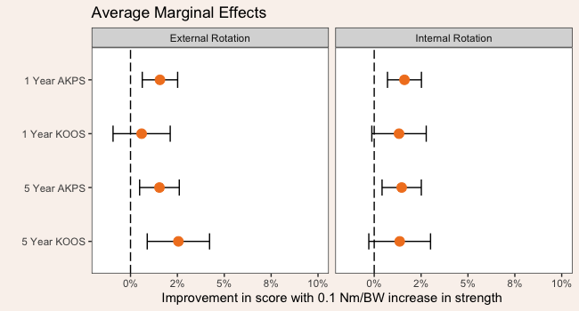
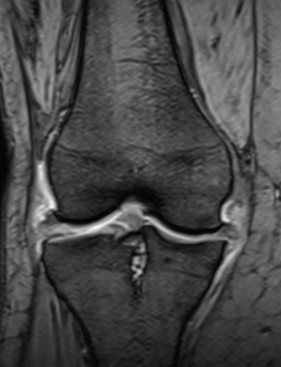
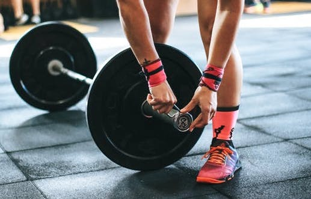

class: inverse, middle, left
background-image: url(laseminverse.png)
background-position:5% 95%
background-size: 50%

## Hip rotation strength after anterior cruciate ligament injury: relationship to functional, symptomatic and structural outcomes

**Michael Girdwood**, Adam Culvenor, Brooke Patterson, Ali Guermazi, Kay Crossley

m.girdwood@latrobe.edu.au

---
## Why the hip after ACL Reconstruction?

.pull-left[
#### What we know:
- 24% of people suffer from patellofemoral pain at 1 year post ACLR .font60[(Culvenor, 2017)]

- Hip muscle weakness is characteristic of PFJ pain and knee osteoarthritis .font60[(Rathleff, 2014)]

- Hip rotation muscles play a role in the control of knee positioning during movement .font60[(Cashman, 2012)]

]

.pull-right[
#### What we **don't** know:

- Limited research into hip rotation strength after ACLR

- Whether hip rotation strength is associated with long term knee sypmtoms

]
---
class: inverse, middle

## Research Question: 

> - How does hip strength differ between the injured and non-injured side in people 1-year after ACLR?

> 

> - Is hip strength associated with functional, symptomatic and structural outcomes?

---

## Methods: participants

.pull-left[
- Longitudinal study monitoring knee joint structure, function and symptoms (Culvenor et al, 2015)

- Primary ACLR (HS autograft) 1 year prior 

- No structured rehab
]

.pull-right[

| Measure |	ACLR Group (n=111) |
|---------|--------------------|
|Age (years)	|27.4 (22.2 - 36.1)
|Gender (n, % F)|	43 (35%)
|Height (cm)|	175 (170 - 181)
|Weight (kg)	|81.2 (67.0 - 90.8)
|BMI (kg/m2)|	25.6 (23.2 - 27.8)
|Tegner Activity |	6 (4 - 7)
.center[.font60[Median (Interquartile Range (IQR)) ]]

]

  

.center[
]

---

## Methods

.center[

**Hip External Rotation & Internal Rotation with HHD**

]

.right[Measured *only at 1 year*]

---

## Methods: Outcomes and Analysis

.m[]

---

### Results: Injured vs non-injured side

.left-column[.black[#### Controlling for gender:

Small but significant difference in ER strength

SMD = -0.33 (-0.6 to -0.07)]

  

.black[No difference in IR strength.]]

.right-column[]

---

## Assocation to .green[Function]

- Both Hip ER and IR were associated with all  measures at 1 year and 5 years.

- Strongest relationships with <u>Hop for Distance</u> and <u>Triple Crossover Hop</u> for both.

- Adjusted R2 values were lower at 5 years:

  

.pull-left[
| .purple[1 Year] | ER | IR | 
|-|---|---|
|Hop for distance| 0.51| 0.47
| One leg rise | 0.24 | 0.21|
| Side Hop | 0.5 | 0.34 |
| Triple Hop | 0.6 | 0.59 |
]

| .green[5 Year] | ER | IR | 
|-|---|---|
|Hop for distance| 0.4| 0.33
| One leg rise | 0.22 | 0.15|
| Side Hop | 0.42 | 0.31 |
| Triple Hop | 0.46 | 0.38 |

.center[.font90[(age and gender included in models)]]

---

## Association to .blue[Symptoms]

- .font90[**Higher** hip ER & IR strength was associated with **superior** AKPS  at 1 and 5 years.]

.center[]

---

## Assocation to .red[Structure] (Imaging)

.pull-left[
- Lower hip ER strength was associated with **worsening tibio-femoral** cartilage lesion score **.black[at 5 years]**  

  - Odds Ratio: 0.01 (95%CI 0.00 to 0.41)

- No other significant relationships identified
]

.pull-right[ ]

---

## Discussion

- Hip ER may influence symptomatic and structural outcomes as it is critical to single leg functional tasks.

- ER specific weakness could result from:

  -  lack of training/rehab

  - weakness broadly of the entire lower limb (not specific to the hip). 

.center[
   
]
   
---

class: middle

## Key Summary

.content-box[
- Hip ER strength was impaired on the injured side at 1 year post ACLR

- This may contribute to functional, symptomatic, and structural outcomes up to 5 years post-operatively.

- Contrary to initial hypothesis, hip rotation strength was not associated with PFJ structure
]    
---

class: inverse, middle
background-image: url(laseminverse.png)
background-position:5% 95%
background-size: 50%

.center[]

## Thank you!

.right[####Questions:

m.girdwood@latrobe.edu.au

@m_girdwood]

